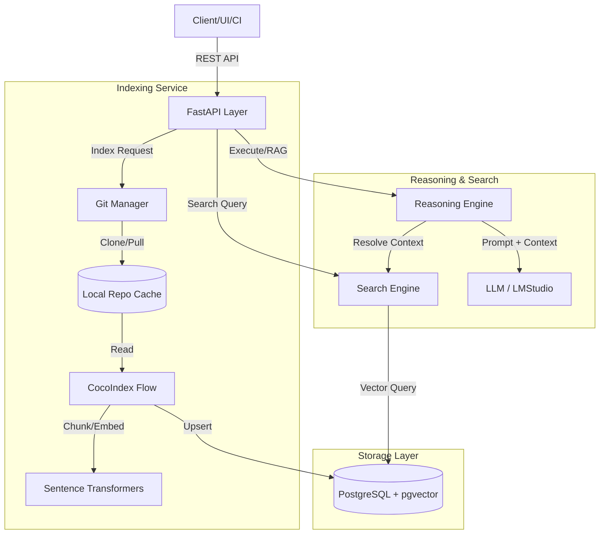
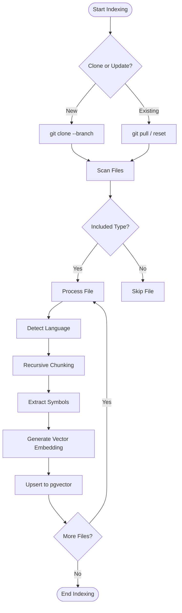
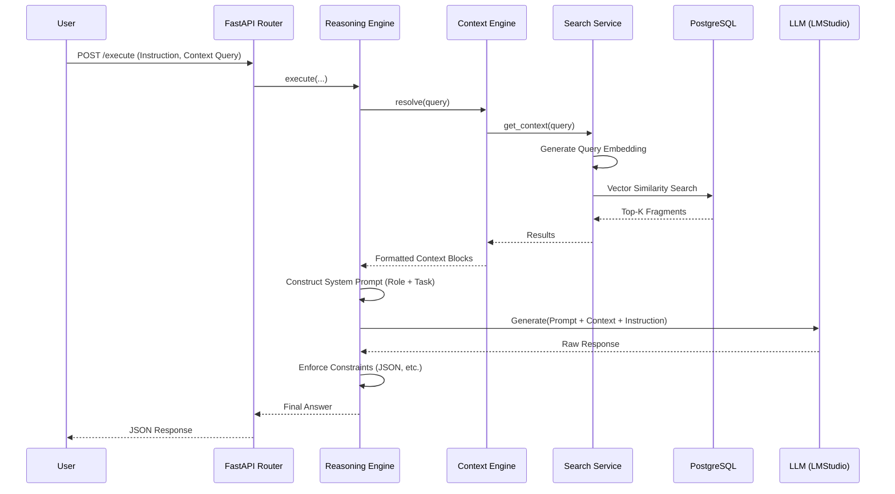

# CodeMind: Semantic Code Indexing & RAG System

CodeMind is a high-performance backend system designed to index source code repositories, generate semantic embeddings, and provide context-aware reasoning via Large Language Models (LLM). It enables developers to perform semantic search across large codebases and build RAG (Retrieval-Augmented Generation) applications.

## 🚀 Key Features

### 1. Advanced Code Indexing
- **Recursive Discovery**: Recursively indexes repository files including `.py`, `.md`, `.rs`, `.toml`, `.js`, `.java`, `.go`, and more.
- **Semantic Chunking**: Uses Tree-sitter aware recursive splitting to maintain code context within chunks.
- **Symbol Extraction**: Automatically identifies classes, functions, and interfaces to enhance search relevance.
- **Vector Embeddings**: Generates high-quality embeddings using `all-MiniLM-L6-v2`.
- **Incremental Updates**: Smart re-indexing that only updates changed files, ensuring efficiency.

### 2. Repository Management
- **Git Integration**: Full support for cloning and pulling from remote Git repositories.
- **Branch Isolation**: Distinct indexing and storage for different branches of the same repository.
- **Isolate Storage**: Local repository caching with directory-level isolation.

### 3. Semantic Search API
- **NLP Queries**: Search code using natural language instead of just keywords.
- **Metadata Filtering**: Filter results by repository, branch, or specific index run IDs.
- **Rich Results**: Returns snippets with file paths, line ranges, and relevance scores.

### 4. RAG & Reasoning Engine
- **Context Resolution**: Automatically retrieves and formats the most relevant code snippets for a given instruction.
- **Role Overlays**: Supports different personas (e.g., Senior Engineer, Security Researcher) to tailor LLM responses.
- **Constraint Enforcement**: Ensures LLM outputs follow specific formats (e.g., valid JSON) and safety rules.

## 🏗️ System Architecture

## 🔄 Indexing Flow

## 📡 Request Sequence (RAG Execution)

## 🛠️ Technology Stack
- **Language**: Python 3.12
- **Framework**: FastAPI
- **Indexing**: CocoIndex
- **Embeddings**: SentenceTransformers (`all-MiniLM-L6-v2`)
- **Database**: PostgreSQL 15+ with `pgvector`
- **LLM**: LMStudio / OpenAI Compatible API
- **Infrastructure**: Docker, Git

## 📂 Project Structure
- `api/`: REST API endpoints and request models.
- `cocoindex_app/`: Core CocoIndex flow definitions and search logic.
- `indexing/`: Git repository operations and directory management.
- `foundation/`: The RAG engine, prompt templates, and constraint logic.
- `memory_service/`: High-level interface for search and context retrieval.
- `llm/`: Drivers for different LLM providers.
