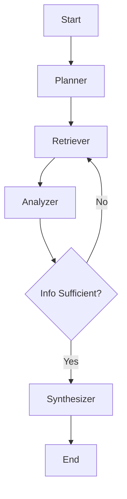

# LangGraph Integration Plan for CodeMind

## Objective
Transform CodeMind's `ReasoningEngine` from a linear execution model into a fully agentic, stateful workflow using **LangGraph**. This will enable complex behaviors such as iterative retrieval, self-correction, planning, and multi-step reasoning.

## Current Architecture vs. LangGraph Architecture

| Feature | Current `ReasoningEngine` | LangGraph `AgentGraph` |
| :--- | :--- | :--- |
| **Control Flow** | Linear (Retrieve -> Context -> LLM) | Cyclic (Plan -> Act -> Observe -> Reflect -> Loop) |
| **State Management** | Ephemeral (passed args) | Persistent `AgentState` (shared across nodes) |
| **Adaptability** | Static prompt chain | Dynamic pathing based on LLM decisions |
| **Tool Use** | Hardcoded logic | Semantic Tool calling (Search, Sandbox, etc.) |

## Proposed Agent Workflow

We will implement a **Plan-and-Execute** style agent or a **ReAct** loop. Given CodeMind's focus on codebase analysis, a **State Machine** with specialized nodes is best.

### 1. State Schema
```python
from typing import TypedDict, Annotated, List, Union
import operator

class AgentState(TypedDict):
    tenant: str
    repo: str
    branch: str
    instruction: str
    
    # Internal state
    plan: List[str]
    current_step: int
    retrieved_context: Annotated[List[dict], operator.add]
    intermediate_answers: Annotated[List[str], operator.add]
    final_answer: str
```

### 2. Nodes (Capabilities)
*   **`Planner`**: Breaks down the user instruction into logical steps (e.g., "Find usage of auth", "Check for vulnerabilities").
*   **`Retriever`**: Uses `StorageManager` to search vector DB and AST index.
*   **`CodeAnalyzer`**: Reads file content and analyzes specific symbols.
*   **`Synthesizer`**: Combines all findings into the final response using the distinct CodeMind aesthetic/persona.

### 3. Graph Structure


## Implementation Roadmap

### Phase 1: Setup & Dependencies
1.  Add `langgraph`, `langchain-core`, `langchain-openai` (or `langchain-community` for generic LLMs) to `requirements.txt`.
2.  Create `backend/foundation/langgraph_engine.py`.

### Phase 2: Tool Wrapping
1.  Wrap `StorageManager.search` as a LangChain `Tool`.
2.  Wrap `StorageManager.get_file_content` (if exists) or create a file reader tool.

### Phase 3: Graph Construction
1.  Define the `AgentState`.
2.  Implement Node functions (`plan_node`, `retrieve_node`, `analyze_node`).
3.  Build the graph using `StateGraph`.

### Phase 4: Integration
1.  Update `ReasoningEngine` to optionally use the graph runner.
2.  Update `/execute` endpoint to stream events from the graph (for real-time UI feedback).

## New File Structure
```
backend/
  foundation/
    engine.py         # (Existing) Wrapper
    agents/
      __init__.py
      graph.py        # Main Graph Definition
      nodes.py        # Node logic
      state.py        # State definition
      tools.py        # Tool wrappers
```

## Prerequisites
- Valid LLM API Key (OpenAI, Anthropic, or Local via LMStudio).
- Existing `StorageManager` must be robust (already fixed).
